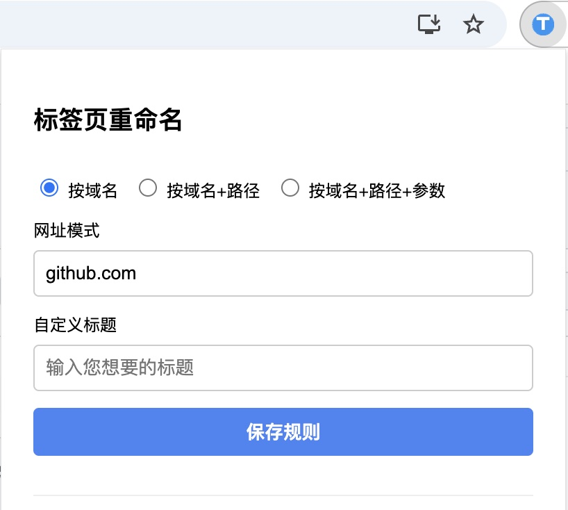

# RenameTab 浏览器扩展

RenameTab是一个Chrome浏览器扩展，可以根据自定义规则自动重命名网页标签页。

由 Cursor 开发完成，记录参考 [Cursor 写一个网页标题重命名的浏览器插件](https://mp.weixin.qq.com/s/_irX3wVl8z3fFz-EYAArCQ)。

## 主要功能

- 支持三种匹配模式：按域名、按域名+路径、按域名+路径+参数
- 参数匹配支持正则表达式
- 设置规则后自动应用到当前页面
- 页面刷新后自动保持自定义标题
- 展示当前匹配的规则，并支持删除
- 将当前匹配的规则置顶显示

## 安装说明

### 开发模式安装
1. 下载或克隆此仓库到本地
2. 打开Chrome浏览器，进入 `chrome://extensions/`
3. 开启右上角的"开发者模式"
4. 点击"加载已解压的扩展程序"
5. 选择此仓库的文件夹

## 使用方法

1. 访问任意网页，点击浏览器工具栏中的RenameTab图标
2. 选择规则类型：按域名、按域名+路径或按域名+路径+参数
3. 网址模式会根据当前页面URL自动填充
4. 如果选择"按域名+路径+参数"，可以针对URL参数进行设置，还可以选择使用正则表达式
5. 在"自定义标题"输入框中输入您想要的标题
6. 点击"保存规则"按钮保存

保存的规则会立即应用到当前页面，并在下次访问匹配的URL时自动应用。

## 规则管理

- 所有已保存的规则会显示在扩展弹窗底部
- 当前匹配的规则会高亮显示并移至列表顶部
- 点击规则旁的"删除"按钮可删除不需要的规则 